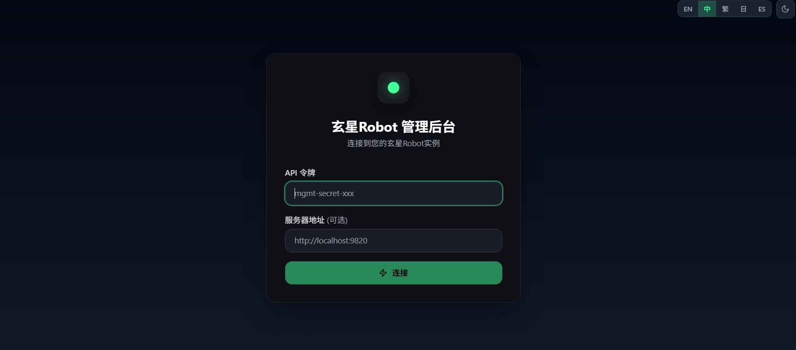
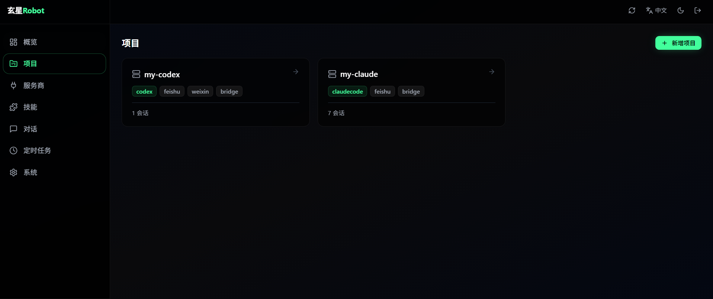
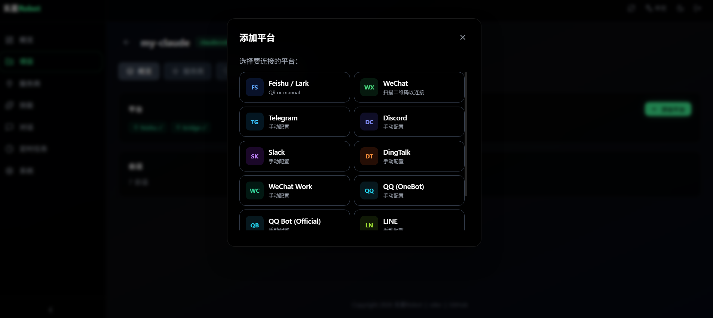
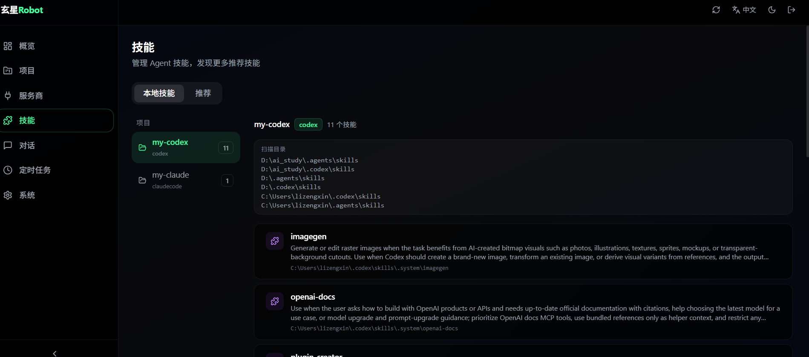
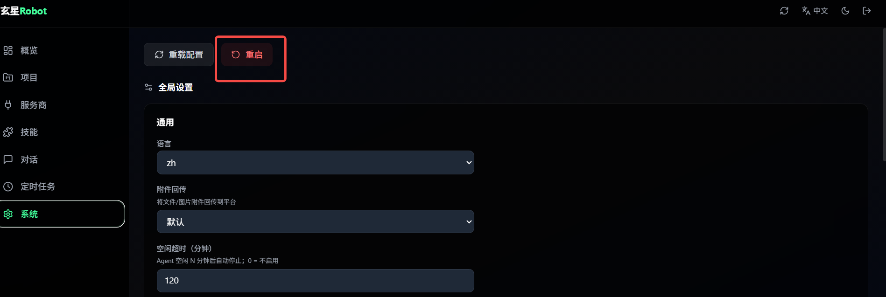

# CC-Connect Ultra

把本地 AI 编码 Agent（Claude Code / Codex / Gemini CLI / Cursor / Dify 等）接到聊天平台（飞书、Telegram、Slack、Discord、企业微信、微信个人号、QQ 等），直接在 IM 里发消息驱动 Agent 工作。

- 仓库地址: https://github.com/ZemarLi549/cc-connect-ultra
- 英文文档（本页）/ 中文文档（可按需补充）: `README.md`

## 核心能力

- 多项目并行：一个 `cc-connect` 进程可管理多个 `[[projects]]`。
- Web 管理台：可视化增删改项目、平台、Provider、会话。
- 会话级项目切换：同一个群/会话可用 `/project switch <项目名>` 指定由哪个项目回复。
- 多平台接入：飞书、Telegram、Slack、Discord、企业微信、微信（ilink）、QQ、QQ Bot 等。
- 丰富运行控制：`/model`、`/mode`、`/provider`、`/cron`、`/dir`、`/memory` 等命令。

## 快速开始

### 1) 安装

```bash
# npm
npm install -g cc-connect
```

或源码构建：

```bash
git clone https://github.com/ZemarLi549/cc-connect-ultra.git
cd cc-connect-ultra
make build
```

### 2) 初始化与可视化配置（推荐）

```bash
cc-connect web
```

这一步会引导你配置并打开管理页面。完成项目/平台配置后，启动服务：

```bash
cc-connect
```

## 手动配置示例（Dify + Feishu）

创建 `config.toml`（可基于 `config.example.toml`）：

```toml
language = "zh"

[[projects]]
name = "my-dify"
show_context_indicator = true
reply_footer = true
inject_sender = false

[projects.agent]
type = "dify"

[projects.agent.options]
work_dir = "./workspaces/dify"
mode = "default"
base_url = "https://api.dify.ai/v1"
api_key = "app-xxxxxxxxxxxxxxxx"
app_mode = "advanced-chat" # advanced-chat | chat | completion | workflow
user = "cc-connect:my-dify"
query_input_key = "query"

# 关键：inputs 必须是字典，不能是 null
inputs = {}

# 如需固定输入参数，可改为：
# [projects.agent.options.inputs]
# tenant = "ops"
# region = "cn"

[[projects.platforms]]
type = "feishu"

[projects.platforms.options]
app_id = "cli_xxx"
app_secret = "sec_xxx"
allow_from = "*"
allow_chat = "*"
```

## 飞书机器人权限清单（必看）

在飞书开放平台为应用开通以下权限与事件：

必选权限（Scopes）：
- `im:message:send_as_bot`：机器人发送消息。
- `im:message.group_at_msg:readonly`：接收群里 @ 机器人的消息。
- `im:message.p2p_msg:readonly`：接收私聊消息。
- `contact:user.base:readonly`：读取基础用户信息（`/whoami`、提及解析、访问控制等）。

按需权限：
- `im:message.group_msg`：接收群内全部消息（当你开启 `group_reply_all = true` 时需要）。

必选事件订阅：
- `im.message.receive_v1`：消息接收事件。
- `card.action.trigger`：交互卡片按钮回调（权限确认、provider/model 切换等）。

如果暂时无法开通 `card.action.trigger`，请在平台配置中设置：

```toml
enable_feishu_card = false
```

详细步骤见：`docs/feishu.md`

## 多项目场景：避免“同一句话回复两次”

当多个项目挂在同一平台/群时，使用会话级项目路由：

```text
/project status
/project switch my-dify
/project switch my-claude
/project remove
```

- `switch`：切换当前会话由哪个项目回复。
- `remove`：清除当前会话绑定，下次会自动由首个可用项目认领。

## 常用命令

```text
/help
/status
/new
/list
/switch <id|name>
/model <name>
/mode <mode>
/provider ...
/cron ...
/project ...
/dir <path|reset>
```

## 常见问题

- `dify: base_url and api_key are required`
  - 检查 `[projects.agent.options]` 下是否正确配置 `base_url` 与 `api_key`，并确认当前运行进程已重启加载新配置。

- `dify ... inputs ... should be a valid dictionary`
  - 配置 `inputs = {}` 或 `[projects.agent.options.inputs] ...`，不要让 `inputs = null`。

- 新增项目后列表不显示
  - 通常是服务未重启或未触发 reload。先保存配置，再重启 `cc-connect`。

## 通用agent预先安装
参考安装指南：`docs/通用agent安装.md`

## 二进制启动部署
config.toml 中token = "xuan666"  初始登录token默认为xuan666, release 下载二进制包，config.toml放同一目录启动即可  访问http://localhost:9820

## 文档导航

- 使用说明：`docs/usage.md`
- 飞书接入：`docs/feishu.md`
- 管理 API：`docs/management-api.md`
- 平台协议桥接：`docs/bridge-protocol.md`

## 项目截图







## License

MIT
